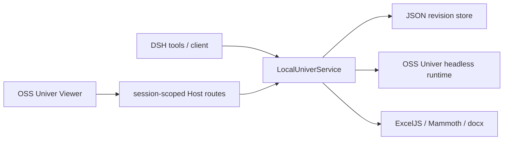

# Architecture

The plugin has four runtime seams:

1. DSH tools and browser routes authorize every path against the active session workspace.
2. `LocalUniverService` owns domain operations and never exposes storage internals to tool definitions.
3. `LocalRevisionStore` persists trunk in the `.univer` JSON file and each worktree in a sidecar directory. Writes use temporary files plus atomic rename and serialize per file inside the Host process.
4. OSS Univer runs in an isolated headless instance for each Sheet/Doc execution. The browser Viewer is built from OSS presets and saves only to an explicit draft worktree.

## Invariants

- Content writes require a `draft` worktree.
- `ready` is read-only until `reopen`; `merged` and `discarded` are terminal.
- Merge requires `worktree.baseRevision === trunk.revision`; otherwise it fails without changing trunk.
- Viewer data and save routes require a live DSH session and a file inside that session workspace.
- Model-visible tools return structured JSON and never depend on parsing shell output.
- Unsupported Pro capabilities are absent from the registered tool surface.

## Source and license boundary

`vendor/univer` is the Apache-2.0 OSS Univer source tree. `vendor/superdoc-document-api` is the AGPL-3.0 engine-agnostic API surface copied from SuperDoc. The proprietary `@superdoc/docx-engine`, all `@univerjs-pro/*` packages, all `@univer-cli/*` packages, and native Pro bindings are outside the repository and outside the build graph.
